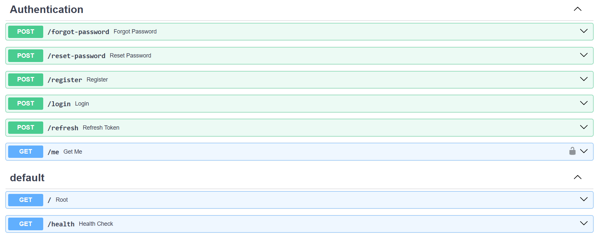
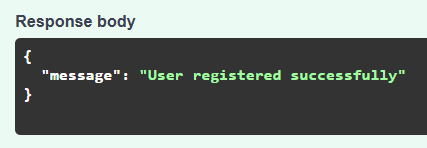
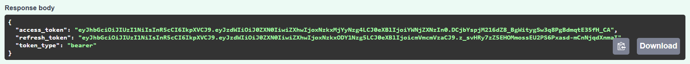
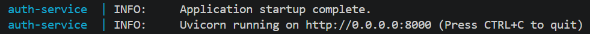
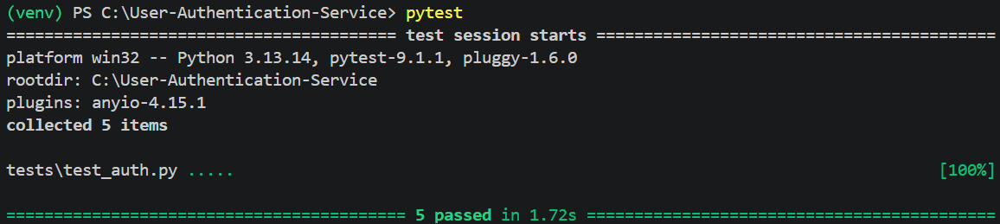

# User Authentication Service

A FastAPI-based authentication service that provides secure user registration, login, JWT authentication, refresh tokens, password reset functionality, database migrations, automated testing, and Docker deployment.

---

## Features

- User Registration
- User Login
- Password Hashing with bcrypt
- JWT Authentication
- Refresh Tokens
- Protected Routes
- Current User Endpoint
- Role-Based Authorization
- Admin Authorization
- Password Reset Workflow
- Environment Variables
- SQLite Database
- Alembic Database Migrations
- Automated Testing with pytest
- Docker Support
- Docker Compose Support

---

## Tech Stack

- FastAPI
- SQLAlchemy
- SQLite
- Alembic
- JWT (python-jose)
- bcrypt
- python-dotenv
- pytest
- Docker
- Docker Compose

---

## Project Structure

```text
User-Authentication-Service/
│
├── alembic/
├── app/
│   ├── core/
│   ├── database/
│   ├── exceptions/
│   ├── models/
│   ├── routers/
│   ├── schemas/
│   ├── services/
│   └── main.py
│
├── tests/
│
├── Dockerfile
├── docker-compose.yml
├── .dockerignore
├── requirements.txt
├── auth.db
└── README.md
```

---

## API Endpoints

### Authentication

| Method | Endpoint |
|----------|----------|
| POST | /register |
| POST | /login |
| POST | /refresh |
| GET | /me |

### Password Reset

| Method | Endpoint |
|----------|----------|
| POST | /forgot-password |
| POST | /reset-password |

---

## Environment Variables

Create a `.env` file in the project root.

```env
SECRET_KEY=your-secret-key

ALGORITHM=HS256

ACCESS_TOKEN_EXPIRE_MINUTES=30

REFRESH_TOKEN_EXPIRE_DAYS=7
```

---

## Running Locally

Install dependencies:

```bash
pip install -r requirements.txt
```

Run the application:

```bash
uvicorn app.main:app --reload
```

Open Swagger:

```text
http://127.0.0.1:8000/docs
```

---

## Database Migrations

Create a migration:

```bash
alembic revision --autogenerate -m "migration name"
```

Apply migrations:

```bash
alembic upgrade head
```

---

## Testing

Run all tests:

```bash
pytest
```

Example output:

```text
==================== test session starts ====================
collected 3 items

tests/test_auth.py ...                           [100%]

==================== 3 passed ====================
```

---

## Docker

Build:

```bash
docker compose build
```

Run:

```bash
docker compose up
```

Open Swagger:

```text
http://localhost:8000/docs
```

Stop:

```bash
docker compose down
```

---

## Screenshots

### Swagger Overview

</img>

### User Registration

</img>

### Login Response

</img>

### Docker Running

</img>

### Pytest Results

</img>

---

## Sample Login Response

```json
{
    "access_token": "jwt-token-here",
    "refresh_token": "refresh-token-here",
    "token_type": "bearer"
}
```

---

## Skills Demonstrated

- REST API Development
- Authentication & Authorization
- JWT Security
- Password Hashing
- SQLAlchemy ORM
- SQLite Database Design
- Alembic Migrations
- Automated Testing
- Docker Containerization
- Environment Configuration
- Backend Application Architecture

---

## Author

Cameron

University of Memphis

Computer Science